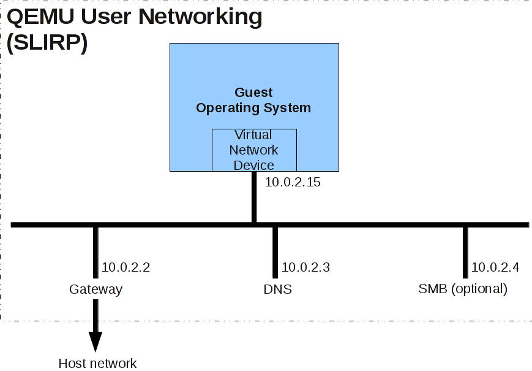
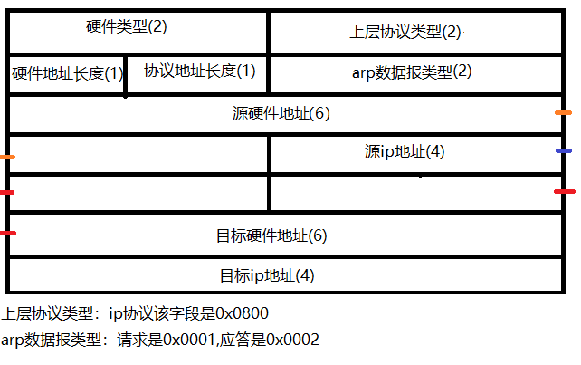
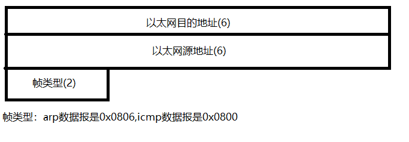
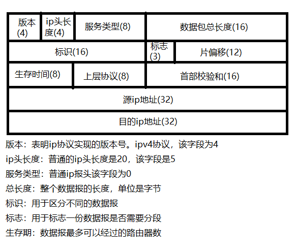

# 操作系统大作业报告
## 实验目的
1. 为xv6系统添加[Intel-e1000](https://pdos.csail.mit.edu/6.828/2011/readings/hardware/8254x_GBe_SDM.pdf)网卡驱动；
2. 增加收取以及发送网络包的系统调用；
3. 增加PCI设备的支持；
4. 实现`arp`包的构造和解析功能；
5. 实现部分`icmp`包的构造和解析功能；

## 实验过程
1. 为了使xv6支持e1000网卡，需要以下三个工作：
	- 修改`Makefile`中`QEMU`的选项，添加网卡支持
	- 实现PCI设备的装载程序（因为网卡是PCI设备）
	- 实现e1000网卡驱动
2. 修改`Makefile`中`QEMU`的选项：
	- 主要工作参考了`QEMU`的官方[Wiki](https://wiki.qemu.org/Documentation/Networking)
	- 添加的选项如下
		- `-net user` 该选项为虚拟机创建了一个局域网，该局域网的结构如下；
		- `-net nic,model=e1000` 该选项为虚拟机添加了e1000网卡；
		- `-redir tcp:$(PORT)::7 -redir udp:$(PORT)::7` 该选项将来自宿主机向`localhost:$(PORT)`的tcp/udp连接重定向到虚拟机的7号端口；
		- `-net dump,file=qemu.pcap` 该选项将所有经过虚拟机的网络包截获，写入`qemu.pcap`文件；
3. 实现PCI设备的装载程序（具体实现请参照`pci.c`,`pci.h`文件）：
	- 主要工作参考了[MIT 6.828 JOS](https://pdos.csail.mit.edu/6.828/2017/)项目；
	- PCI设备的端口定义使用了[NetBSD: pcireg.h, v1.45](http://www.scs.stanford.edu/histar/src/kern/dev/pcireg.h)；
	- 装载PCI设备的过程主要如下：
		- 一共遍历32个设备总线，查看该位上是否存在设备，如果存在设备则开始装载设备；
		- 按照设备类别，读入设备信息，分配中断号；
		- 按照读取到的`Vecdor ID`与`Device ID`来查询设备驱动表，根据预先设置的设备驱动的函数指针，调用相关设备驱动的初始化程序，并注册该设备；
4. 实现e1000网卡驱动（具体实现参考`e1000.c`,`e1000.h`文件）
	- e1000网卡驱动的实现主要参考[MIT 6.828 Lab6](https://pdos.csail.mit.edu/6.828/2017/labs/lab6/)以及[官方开发手册](https://pdos.csail.mit.edu/6.828/2017/readings/hardware/8254x_GBe_SDM.pdf)；
	- e1000网卡端口定义主要参考[e1000_hw.h](https://pdos.csail.mit.edu/6.828/2017/labs/lab6/e1000_hw.h)；
	- 网卡驱动初始化(`int pci_e1000_attach(struct pci_func *pcif)`)：
		- 首先分配网卡结构体的空间，结构体定义如下：
			
			```C
			struct e1000 {
				struct e1000_tbd *tbd[E1000_TBD_SLOTS];
				struct e1000_rbd *rbd[E1000_RBD_SLOTS];
				struct packet_buf *tx_buf[E1000_TBD_SLOTS];  //packet buffer space for tbd
				struct packet_buf *rx_buf[E1000_RBD_SLOTS];  //packet buffer space for rbd
				int tbd_head;
				int tbd_tail;
				char tbd_idle;
				int rbd_head;
				int rbd_tail;
				char rbd_idle;
				uint32_t iobase;
				uint32_t membase;
				uint8_t irq_line;
				uint8_t irq_pin;
				uint8_t mac_addr[6];
			};
			```


		- 将`Transmit Ring`中变量初始化：
		- 为`Receive ring`上每一个描述符中的网络包的buffer分配空间
		- 初始化与发包相关的寄存器
			- `E1000_TDBAL`与`E1000_TDBAH`赋值为`Transmit ring`的地址的低32位与高32位
			- `E1000_TDLEN`赋值为`Transmit ring`中描述符(`Transmit descriptor`)的个数
			- `E1000_TDT`与`E1000_TDH`赋值为`Transmit ring`的头尾指针
			- `E1000_TCTL(Transmit control register)`设置为`0x0004010A`以使能网卡的收包功能
			- `E1000_TIPG`设置最小的合法包内间距
		- 初始化与收包相关的寄存器
			- `E1000_RAL`与`E1000_RAH`赋值为当前网卡的MAC地址的低32位于高32位，并且用Mask使能
			- `E1000_RDBAL`与`E1000_RDBAL`设置为`Receive ring`地址的低32位与高32位
			- `E1000_RDLEN`赋值为`Receive ring`中描述符(`Receive descriptor`)的个数
			- `E1000_RDT`与`E1000_RDH`设置为`Receive ring`的头尾指针
			- 设置`E1000_RCTL`上对应位，配置网卡收包功能
	- 网卡驱动收包函数(`void e1000_recv(void *e1000, uint8_t* pkt, uint16_t *length)`)
		- 检查`Receive ring`尾指针指向位置的下一个位置上的描述符的状态值(`status`)，如果`E1000_RXD_STAT_DD`与`E1000_RXD_STAT_EOP`定义的对应位置设为`1b`，则认为接收到网络包（网卡硬件自动将该网络包复制到`Receive ring`）
		- 如果检查状态量发现收到网络包了，则将`Receive ring`尾指针指向位置的下一个位置上的描述符复制返回，将原位置描述符中对应变量清空，将尾指针加一；这里需要注意由于`Receive ring`是一个循环队列，则尾指针加一需要mod描述符数量；
	- 网卡驱动发包函数(`void e1000_send(void *e1000, uint8_t* pkt, uint16_t length)`)
		- 检查`Transmit ring`中尾指针指向的描述符位置是否可用（是否已经传输结束）
		- 如果可用，将外部构建好的`Transmit descriptor`复制到`Transmit ring`中尾指针指向的位置，并将指针后移一位

5. `arp`协议和`icmp`协议
	- 实现协议只需要掌握不同协议下的网络数据包的结构即可
	- 完整的arp数据包由以太网报头和数据构成
	- 完整的icmp数据包由以太网报头+ip报头+icmp数据构成
	- arp数据的结构如下
	
	- icmp数据的结构如下
	
	- 以太网报头的结构如下
	
	- ip报头的结构如下
	

## 问题及解决方法
1. 问题：初步写完运行，使用发包函数的时候总是会出现内存错误。

	解决方法：由于网卡这类外部设备在访问内存的时候不经过MMU(Memory Management Unit)处理，而是通过DMA(Direct Memory Access)，因而所有网卡相关的内存地址都应该使用物理地址，使用虚拟地址自然会导致内存错误。
	
2. 问题：网卡收到网络包的时候不触发中断。

	解决方法：最终没有解决不触发中断的问题，我们认为可能的原因有两个方面：第一网卡上某些中断相关的寄存器没有正确初始化，第二没有正确分配`irp_line`与中断号。因此我们采取不断询问网卡是否收到网络包的方式来读取网卡收到的网络包。

3. 问题：网卡驱动的编写涉及到硬件调试，如果使用输出调试法会非常麻烦，并且很多情况下并不能使用输出调试法，因为网卡硬件会自动处理一些事情。

	解决方法：[MIT 6.828 JOS](https://pdos.csail.mit.edu/6.828/2017/)项目提供了为课程特殊设计的`QEMU`，可以将网卡行为详细打印出来，但是源代码在MIT的校园网内部无法直接获取；后在Github上搜索发现其[备用镜像](https://github.com/dznaix/mit-qemu)，使用后极大的提高了网卡驱动开发效率。


## 正确性验证
1. 采用较为简单的`arp`协议来验证是否能够正确地收发数据包。过程如下:
	- 构造一个arp数据包，询问某个`ip`地址对应的`mac`地址
	- 用网卡发送这个数据包
	- 采用循环等待的方式接受网卡返回的数据包
	- 解析这个数据包，打印出`mac`地址
	测试命令`arptest <ipadress>`
2. 对于`icmp`协议，由于qemu的网关不对icmp请求进行响应，于是只能通过`tcpdump -XXnr qemu.pcap`命令进行测试。
	- 使用`QEMU`提供的网络包截取工具将所有经过虚拟机的网络包记录在`qemu.pcap`文件中，使用`tcpdump -XXnr qemu.pcap`命令可以将内容打出
	- 测试命令`icmptest`会构造一个请求网关响应的数据包。
	- 用`tcpdump -XXnr qemu.pcap`命令自带的包解析功能可以验证数据包格式的正确性。

## 实验结果
1. 可以正确地接受、发送数据包
2. 可以正确地构造和解析`arp`数据包
3. 可以正确地构造和解析部分`icmp`数据包

## 实验思考与总结
1. 我们组最初的设想是我们组最初的设想是为xv6添加完整的TCP/IP栈支持，并且添加网卡支持，使得xv6可以联网。但最终我们决定把重点放在实现网卡驱动上，对于网络协议，我们只实现了其中较为简单的`arp`协议和部分`icmp`协议，放弃了实现/移植完整的网络协议栈的计划，原因有以下几点
	- 实现完整协议栈的工作量太大，并且和操作系统这门课程的关联不紧密
	- 已经有往届的小组用交叉编译的方式完成过移植网络协议相关接口的工作，做重复的工作意义不大
	- 考虑到课程最终目标是“把各小组的工作整合成一个较好的操作系统”，而往届的小组只完成了相关接口的移植，并不能在物理上和别的主机通信。我们认为把重心放在编写网卡驱动上是一个非常好的选择，这个工作完成之后，和相应的协议栈进行整合之后，就可以很方便地和网络上的其他主机通信了。
2. 在编写网卡驱动的过程中，发现网络上相关资料几乎为零，而给xv6添加e1000网卡驱动也几乎没有人成功做出来，Github上为数不多的几个相关项目如下：[s-shin/xv6-network](https://github.com/s-shin/xv6-network)使用的是NE2000网卡，[vibhorvatsa/xv6-networking-stack](https://github.com/vibhorvatsa/xv6-networking-stack)收到网络包的时候无法触发中断；因而就需要大量翻阅e1000的[开发者手册](https://pdos.csail.mit.edu/6.828/2011/readings/hardware/8254x_GBe_SDM.pdf)，这一过程固然比较痛苦，但是同时也极大的锻炼了我硬件编程以及查阅资料的能力。
3. 如果要给之后的工作提一些建议的话，首先，工欲善其事必先利其器，我们希望为xv6系统添加更加高级的内存管理方式，线程支持，完善进程间通信机制等，并且封装一套较为完整的POSIX，这样才能较为优雅的在xv6上进行用户态程序的开发，并且能够使得团队协作更为优雅；下面，就可以移植LwIP项目，完善网卡驱动部分，解决不触发中断的问题，最终为xv6系统添加完整的网络命令，例如`ping`,`curl`等。

## 代码说明
- 源代码放置于`./src`文件夹内
- 为了说明我们所做的工作，我们基于MIT原项目代码生成了patch文件，放置于`./patch`文件夹内，使用时请将该文件置于[mit-pdos/xv6-public](https://github.com/mit-pdos/xv6-public)项目的目录下，使用`git apply *.patch`命令即可打上补丁获得我们最终的代码

## 组内分工
- 洪方舟
	- 编写PCI设备支持，e1000网卡驱动代码
	- 编写PCI设备支持与e1000网卡驱动相关文档
- 李仁杰
	- 编写`arp`和`icmp`协议的代码和文档
	- 程序测试
- 李帅
	- 查阅TCP\IP协议文档
	- 协助网卡驱动编写
- 谭新宇
	- 查阅TCP\IP协议文档
	- 协助`arp`和`icmp`协议的编写	